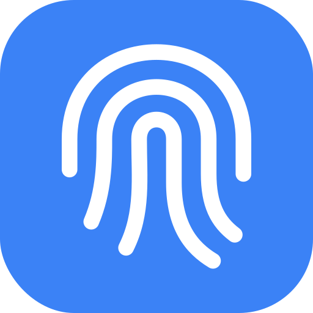

  

# SenseTouch

**갤럭시의 지문 인식률 향상 화면을 간편하게 여는 앱입니다.**

일부 갤럭시에는 등록한 지문을 추가로 스캔하는 화면이 들어 있지만, 설정 메뉴에서는 보이지 않습니다. SenseTouch는 그 화면에 접근할 수 있도록 만든 작은 앱입니다. 지문을 선택하고 실행하면 이후의 인증과 스캔은 삼성 시스템 화면에서 진행됩니다.

[APK 다운로드](../../releases) · [원본 프로젝트](https://github.com/asdfasdf-asdfasdf/FingerprintAccuracyEnhancer)

## 어떤 기능인가요?

이미 등록된 손가락을 다시 스캔하는 삼성의 지문 인식률 향상 기능입니다. 기기에 따라 ‘Secured by Knox’ 표시와 함께 지문을 10회 스캔하라는 안내가 나올 수 있습니다. 화면이 열리면 기기에 표시되는 안내대로 진행하면 됩니다.

SenseTouch가 하는 일은 사용할 지문을 선택하고 이 화면을 요청하는 것까지입니다. 지문 처리와 인증은 삼성 시스템이 담당하며, 앱에서 인식률을 측정하거나 개선 정도를 확인하지는 않습니다. 효과는 기기와 사용 환경에 따라 다를 수 있습니다.

## 어떤 기기에서 쓸 수 있나요?

**설치는 Android 9 이상에서 가능하지만, 기능 실행에는 삼성의 해당 지문 화면이 필요합니다.**

| 항목 | 조건 |
| --- | --- |
| 운영체제 | Android 9 이상 |
| 기기 | 삼성 Galaxy |
| 시스템 기능 | `FingerprintUpdateActivity`가 존재하고 활성화되어 있어야 함 |
| 지문 | 기기 설정에 지문이 등록되어 있어야 함 |
| 권한 | 최초 설정에 Shizuku 및 시스템 설정 권한 필요 |

현재 SenseTouch의 동작을 모델별로 확인한 지원 목록은 없습니다. 따라서 ‘S20부터’, ‘S23 이상’처럼 시작 모델을 정해 안내하기는 어렵습니다. 같은 모델도 One UI 버전과 펌웨어에 따라 결과가 달라질 수 있습니다.

앱에서 삼성 기기 여부와 해당 화면의 존재를 먼저 확인합니다. 화면을 찾지 못하면 실행 버튼을 사용할 수 없으며, 화면이 있어도 OS의 제한으로 열리지 않을 수 있습니다. One UI 버전 표시는 참고 정보입니다.

설정에서 이미 **지문 인식 향상** 메뉴를 사용할 수 있다면 그 메뉴를 이용하면 됩니다. 갤럭시 S26에서 등록된 지문을 눌러 추가 스캔을 진행하는 [Samsung Members 사용 후기](https://r1.community.samsung.com/t5/갤럭시-s/갤럭시-s26-지문-인식-정확도-향상-기능-사용해보기/td-p/37297270)가 있습니다. 이는 삼성 설정의 사용 사례이며, SenseTouch의 지원 기종 목록이나 삼성의 공식 호환성 표는 아닙니다.

## 사용 방법

1. [Releases](../../releases)에서 APK를 받아 설치합니다. `Source code` 파일은 설치 파일이 아닙니다.
2. [Shizuku](https://shizuku.rikka.app/)를 설치하고 기기에 맞는 방법으로 실행합니다. 시작 방법은 [Shizuku 사용 안내](https://shizuku.rikka.app/guide/setup/)를 참고하세요.
3. SenseTouch를 열고 **권한 설정하기**를 눌러 Shizuku 권한을 허용합니다.
4. 등록된 지문 목록에서 사용할 지문을 선택합니다.
5. **지문 인식률 향상**을 누르고 안내를 확인합니다.
6. 삼성 화면이 열리면 기기 인증과 추가 스캔을 진행합니다.

초기 설정으로 부여한 시스템 설정 권한이 유지되는 동안에는 Shizuku가 실행 중이지 않아도 사용할 수 있습니다. 권한이 회수되거나 앱을 다시 설치한 경우에는 설정이 다시 필요할 수 있습니다.

자동 조회가 제한되는 기기에서는 **번호로 직접 선택**을 사용할 수 있습니다. 다만 수동 번호가 실제 지문과 대응하는지는 기기별 확인이 필요합니다. 선택한 지문과 다른 안내가 나오면 진행을 취소하세요.

## 숨겨진 화면은 어떻게 여나요?

Shizuku를 통해 SenseTouch에 시스템 설정 변경 권한을 부여합니다. 실행할 때는 기존 디지털 어시스턴트(Assistant) 설정을 먼저 저장하고, 잠시 삼성 지문 화면을 가리키도록 변경한 뒤 Android의 Assistant 실행 경로로 화면을 요청합니다. 선택한 지문의 ID도 이때 전달합니다.

요청 후에는 원래 Assistant 설정으로 복원을 시도하며, 실행 도중 오류가 나도 복원 처리를 거칩니다. 설정 메뉴에 항목을 영구적으로 추가하는 방식은 아닙니다. 기기 인증은 시스템이 요구하는 절차를 그대로 따라야 합니다.

복원이 끝나기 전에 앱이 종료되면 다음 실행에서 저장된 기록을 이용해 다시 복원을 시도합니다. **‘설정 복원이 필요해요’가 표시되면 먼저 복원 재시도를 진행해 주세요.** 복원 대기 중 앱을 삭제하거나 데이터를 지우면 복구 기록도 사라집니다. 문제가 계속되면 기기 설정에서 기본 디지털 어시스턴트를 직접 선택해 주세요.

## 지문 정보를 가져가나요?

등록된 지문의 이름과 ID는 목록 표시와 선택에만 사용합니다. 이 목록을 앱의 영구 저장소에 저장하거나 외부로 전송하지 않습니다. 지문 이미지와 생체 템플릿은 읽지 않습니다.

인터넷 권한, 광고, 분석 SDK가 없으며 앱의 지문 기능은 오프라인으로 동작합니다. GitHub와 Shizuku 안내 링크는 외부 브라우저로 열립니다. Assistant 설정의 이전 값은 복구를 위해 앱 내부에 잠시 저장합니다.

## 잘 안 될 때

| 표시되는 상태 | 확인할 내용 |
| --- | --- |
| 지원하지 않는 기기 | 현재 펌웨어에서 필요한 삼성 화면을 찾지 못한 상태입니다. |
| Shizuku 미설치·미실행 | Shizuku를 설치하거나 실행한 뒤 다시 돌아와 주세요. |
| Shizuku 권한 거부 | Shizuku의 승인된 앱 목록에서 SenseTouch 권한을 확인해 주세요. |
| 지문 자동 조회 실패 | 새로고침을 시도해 주세요. 비공개 API가 제한된 기기에서는 수동 선택을 사용할 수 있습니다. |
| 화면 요청 후 아무것도 열리지 않음 | 현재 OS에서 실행 경로가 제한된 것일 수 있습니다. ‘요청됨’은 화면 실행이나 스캔 완료를 뜻하지 않습니다. |
| 설정 복원 대기 | 시스템 설정 권한을 확인한 뒤 복원 재시도를 눌러 주세요. |

문제를 제보할 때는 기기 모델, Android·One UI 버전, 앱 버전, 표시된 오류를 함께 알려주시면 원인을 확인하는 데 도움이 됩니다.

## 제작에 관해

이 앱은 [FingerprintAccuracyEnhancer](https://github.com/asdfasdf-asdfasdf/FingerprintAccuracyEnhancer)를 바탕으로 **ChatGPT/Codex를 활용해 제작했습니다.** 화면 구성과 아이콘을 새로 만들고, 기기 확인·권한 안내·설정 복원 처리를 다듬었습니다.

AI를 코드 작성과 수정, 검토에 활용했습니다. 빌드와 자동 검사를 거쳤지만 모든 갤럭시에서 테스트한 것은 아닙니다. 현재 공개 버전은 **1.0.0**이며, 확인한 범위는 [검증 기록](VALIDATION.md)과 [빌드 결과](validation-summary.txt)에 남겨 두었습니다.

삼성의 공식 앱은 아닙니다.

## 소스와 라이선스

GPL-3.0-only로 공개합니다. 원본 프로젝트와 그 기반이 된 [Root Activity Launcher](https://github.com/zacharee/RootActivityLauncher)의 출처를 유지하고 있습니다.

라이선스와 의존성 정보는 [LICENSE](LICENSE), [원본 출처](UPSTREAM-SOURCE-NOTICE.md), [라이브러리 고지](THIRD-PARTY-NOTICES.md)를 참고해 주세요.

직접 빌드하거나 배포하려면 [배포 안내](RELEASE-BUILD.md)를 확인하세요.

Made by [Adam](https://github.com/Adam-yam)
